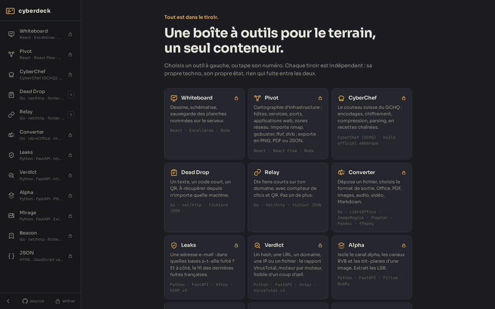

# Cyberdeck

Une boîte à outils web auto-hébergée pour consultants en cybersécurité : **un seul conteneur**, une page d'accueil avec un tiroir par outil, et chaque outil construit avec la techno qui lui va le mieux.



| Tiroir | Ce qu'il fait | Techno |
| --- | --- | --- |
| **Pivot** | Cartographie d'infrastructure en glisser-déposer : hôtes, conteneurs, services, applications web, bases, équipements réseau, cloud, zones et notes, reliés par des liens libellés (port, HTTP, tunnel, confiance…) ; import nmap (-oN/-oX/-oG), gobuster, ffuf, dirb ; disposition automatique ; export PNG, PDF ou JSON ; cartes enregistrées sur le serveur | React · React Flow · dagre · Node |
| **Whiteboard** | Dessin et schémas avec Excalidraw, planches nommées enregistrées sur le serveur, autosave, export PNG/SVG | React · Excalidraw · Node |
| **CyberChef** | Le build officiel du GCHQ, servi tel quel : encodages, chiffrement, compression, parsing, recettes chaînées | CyberChef (Apache-2.0), téléchargé au build |
| **Dead Drop** | Un texte → un code de 5 caractères + QR + lien ; `curl /p/CODE` depuis un terminal ; expiration, destruction à la lecture | Go |
| **Converter** | Dépose un fichier, choisis la sortie : Word/Excel/PowerPoint/OpenDocument ↔ PDF, PDF → images ou Word, Markdown → HTML/Word/PDF, images ↔ PNG/JPEG/WebP/ICO/PDF, audio et vidéo via ffmpeg | Go pilotant LibreOffice, ImageMagick, Poppler, Pandoc, img2pdf, ffmpeg |
| **Leaks** | Une adresse e-mail → les bases où elle a fuité (Have I Been Pwned v3, clé requise), pastes, test de mot de passe par k-anonymat, et un fil des dernières fuites françaises (Bonjour la fuite, ZATAZ, Numerama, CERT-FR) et mondiales (HIBP) | Python · FastAPI · httpx |
| **Verdict** | Un hash (MD5, SHA-1, SHA-256), une URL, un domaine, une IP ou un fichier déposé (32 Mo max) → le rapport VirusTotal : verdict global, classification de menace, détails (noms, taille, signataire, whois, DNS, redirections…), tableau moteur par moteur filtrable ; soumission d'URL ou de fichier inconnus avec suivi de l'analyse | Python · FastAPI · httpx · VirusTotal v3 |
| **Relay** | Dix liens courts maximum sur ton domaine (`/s/mon-raccourci`), compteur de clics, QR, raccourci personnalisable | Go |
| **Beacon** | Un annuaire de sites utiles rangés par famille (DevOps, cybersécurité, news, cracking, forensic, OSINT… et n'importe quelle autre) : une carte par site avec nom, description et favicon ; ajout par URL avec lecture automatique du titre et de la description, ajout en vrac (`url | nom | description | famille`), glisser-déposer d'un lien, filtre, renommage de famille, export JSON | Go |
| **Mirage** | Une image ou une vidéo est-elle sortie d'une IA ? Preuves d'abord : Content Credentials (C2PA) signés, marqueur IPTC « trainedAlgorithmicMedia », métadonnées laissées par Stable Diffusion (AUTOMATIC1111, ComfyUI, NovelAI), Midjourney, Firefly, DALL·E et consorts, filigrane invisible de Stable Diffusion ; puis indices : empreinte caméra, dimensions typiques, et un score statistique optionnel (Sightengine). Vidéos analysées via leurs métadonnées et trois images extraites ; dépôt de fichier ou URL ; rien n'est conservé | Python · FastAPI · ExifTool · c2pa · OpenCV · ffmpeg |
| **Alpha** | Rendre le noir, le blanc ou une couleur transparent (avec tolérance et bords adoucis), canal alpha, canaux RVB, 32 bit-planes, pixels cachés sous la transparence, extraction LSB | Python · FastAPI · Pillow · NumPy |
| **JSON** | Validation avec position d'erreur, indentation, compactage, tri des clés, réparation de JSON approximatif, arbre repliable, recherche par chemin | JavaScript vanilla, 100 % navigateur |

## Lancer

```bash
docker run -d --name toolbox -p 7850:8080 -v ./data:/data \
  -e PUBLIC_URL=https://toolbox.example.com \
  ghcr.io/clemdepernet/cyberdeck:latest
```

Ou avec le `docker-compose.yml` fourni. L'image est multi-arch (amd64, arm64 : elle tourne sur un Raspberry Pi 5). Elle pèse environ 1,5 Go, LibreOffice et ffmpeg oblige.

| Variable | Défaut | Rôle |
| --- | --- | --- |
| `PUBLIC_URL` | déduit de la requête | URL publique, utilisée dans les liens et QR codes des pastes |
| `APP_PASSWORD` | vide (ouvert) | Demande une connexion (identifiant `APP_USER`, `toolbox` par défaut) pour les outils protégés : l'accueil et les outils marqués `"public": true` dans leur `tool.json` (Dead Drop, Relay) restent utilisables par tout le monde, les autres ouvrent une fenêtre de connexion sur fond flouté. Cookie de session de 30 jours, `curl -u` accepté pour les scripts, `/s/…`, `/p/CODE` et `/health` toujours ouverts |
| `APP_USERS` | vide | Comptes supplémentaires, paires `identifiant:motdepasse` séparées par des virgules (`client:secret,audit:autre`). Ils ouvrent et utilisent tous les outils mais ne suppriment rien : planches Whiteboard, cartes Pivot, dead drops et liens Relay restent supprimables par le compte principal seulement ; dans Beacon ils ajoutent sans modifier ; dans Relay ils créent un lien par jour. Les visiteurs non connectés lisent les dead drops et suivent les liens, sans en créer ni en supprimer |
| `PUID` / `PGID` | 1000 | Propriétaire de `/data` |
| `TZ` | UTC | Fuseau horaire des logs |
| `MAX_LINKS` | 10 | Nombre maximal de liens courts dans Relay |
| `HIBP_API_KEY` | vide | Clé [Have I Been Pwned](https://haveibeenpwned.com/API/Key) : sans elle, la recherche par e-mail de Leaks est désactivée, le reste fonctionne |
| `VT_API_KEY` | vide | Clé [VirusTotal](https://www.virustotal.com/gui/my-apikey) (gratuite : 4 requêtes/min, 500/jour) : sans elle, Verdict est désactivé |
| `SIGHTENGINE_USER` / `SIGHTENGINE_SECRET` | vide | Identifiants [Sightengine](https://sightengine.com) (offre gratuite) : ajoutent un score statistique d'IA dans Mirage ; sans eux, Mirage ne rend que les preuves locales |

`/data` contient un sous-dossier par outil (`whiteboard/`, `pivot/`, `paste/`…). Rien d'autre à sauvegarder.

Le deck est pensé pour être exposé derrière un reverse proxy ou un tunnel Cloudflare. La connexion est gérée par `gate/` (Go, `auth_request` nginx) : il lit les outils publics dans le manifeste et ses règles sont testées dans `gate/main_test.go`. Sans `APP_PASSWORD`, tout le monde peut créer des pastes : le service Go limite le débit par IP (création et lecture) et les codes sont tirés dans un alphabet de 31 caractères sur 5 positions.

## Raccourcis

- `Alt+1` … `Alt+9` : changer d'outil, `Alt+0` : replier le bandeau.
- `Ctrl+S` dans le whiteboard : enregistrer maintenant (sinon autosave 1,5 s après le dernier trait).
- Dans Pivot : `Ctrl+I` ouvre l'import de scan, `Ctrl+Z` / `Ctrl+Y` annule et refait, `Ctrl+D` duplique, `Suppr` efface, `Maj` + glisser sélectionne une zone. « Éclater les ports » crée un nœud Service par port ouvert d'un hôte.
- `https://…/s/raccourci` : lien court, accessible sans connexion même si `APP_PASSWORD` est défini.
- `https://…/p/CODE` : ouvre un paste en lecture, sans connexion. Avec `curl`, `wget` ou `Accept: text/plain`, renvoie le texte brut.
- Coller une image (`Ctrl+V`) dans Alpha suffit, pas besoin de fichier.
- Converter limite les envois à 512 Mo, garde le fichier 30 minutes et lance deux conversions en parallèle au maximum. Les conversions refusées (PDF → MP3) répondent 422 proprement.
- CyberChef garde ses options (thème sombre, favoris) dans le navigateur, via son menu Options.

## Ajouter un outil

Chaque outil vit dans `tools/<id>/` et décrit lui-même comment il se branche :

```
tools/<id>/
├── tool.json        nom, accroche, techno, icône, ordre → alimente les onglets
├── nginx.conf       ses blocs `location` (statique ou proxy vers son process)
├── supervisor.conf  (optionnel) le process à lancer, sur 127.0.0.1:81xx
└── …                son code, dans la techno de son choix
```

```bash
scripts/new-tool.sh hashes "Hashes" "md5, sha1, sha256 d'un texte ou d'un fichier" "HTML · JavaScript"
docker compose up -d --build
```

Le script crée un outil statique prêt à l'emploi ; l'onglet apparaît au prochain build (le manifeste `shell/tools.json` est généré par `scripts/build-manifest.py`). Pour embarquer une app web existante sans la compiler, copie le modèle du stage `cyberchef-build` (téléchargement d'une release puis `COPY --from`). Pour un outil avec backend, ajoute un `supervisor.conf`, proxy-le depuis son `nginx.conf` et compile-le dans un stage du `Dockerfile` (les stages `whiteboard-build` et `paste-build` servent de modèles).

Conventions qui gardent le deck cohérent :

- Un outil est servi sous `/<id>/` et charge `/theme.css` (palette, boutons, champs) et `/deck.js` (relais des raccourcis clavier depuis l'iframe).
- Ses données vont dans `/data/<id>/`, créé au démarrage avec les bons droits.
- Ses ports sont locaux au conteneur (`127.0.0.1:81xx`) ; seul nginx écoute sur `8080`.
- Un paramètre d'URL peut être passé depuis le shell : `#paste?code=K7X2M` ouvre l'outil avec `?code=K7X2M`.

## Développement

```bash
docker build --target test .        # tests Go, Python et Node dans l'image réelle
docker compose up --build           # le deck sur http://localhost:7850
```

Tests unitaires par outil : `tools/paste`, `tools/links`, `tools/bookmarks` et `gate` (`go test`), `tools/alpha` (`pytest`), `tools/whiteboard` (`node --test server.test.mjs`), `tools/pivot` (`node --test server.test.mjs` et `npm test` dans `app/` pour les parseurs de scans), `tools/verdict` et `tools/mirage` (`pytest`).

## Licence

MIT. Excalidraw est sous licence MIT également.
